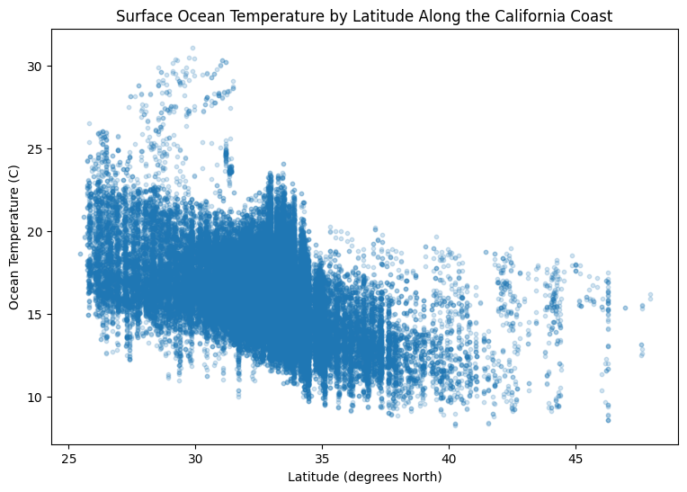

# California Coastal Conditions Pipeline

A data pipeline that joins 70 years of CalCOFI ocean chemistry measurements to fixed
points on the California coast, and pairs each one with current weather at that location.

The three sources share no identifier. CalCOFI records ship positions out at sea,
Wikipedia's lighthouse table records fixed points on land, and the weather API takes
coordinates. The join key had to be built: every ocean reading is matched to its nearest
lighthouse by haversine distance, then filtered by how far that match actually stretched.

Final dataset: **67,092 rows, 16 columns**, stored in SQLite.



Surface water cools moving north, from roughly 15-30 °C near latitude 25 down to 10-15 °C
past latitude 40. The upper edge falls away around latitude 34, at the corner where the
coastline turns at Point Conception and colder water takes over.

## Sources

| Source | Type | What it contributes |
| --- | --- | --- |
| [CalCOFI Bottle and Cast databases](https://calcofi.org/data/oceanographic-data/bottle-database/) | CSV (latin-1) | Depth, temperature, salinity, dissolved oxygen, cast coordinates, 1949-2021 |
| [List of lighthouses in California](https://en.wikipedia.org/wiki/List_of_lighthouses_in_California) | HTML scrape | 50 fixed coastal reference points with coordinates |
| [OpenWeatherMap Current Weather](https://openweathermap.org/api) | JSON API | Air temperature, humidity, wind, conditions per coordinate |

## Pipeline

| Notebook | What it does |
| --- | --- |
| [`01_clean_calcofi.ipynb`](notebooks/01_clean_calcofi.ipynb) | Joins Bottle to Cast on `Cst_Cnt`, drops incomplete and physically impossible rows, renames fields to readable names with units |
| [`02_scrape_lighthouses.ipynb`](notebooks/02_scrape_lighthouses.ipynb) | Scrapes the Wikipedia table, regex-extracts decimal coordinates from mixed DMS text, corrects longitude sign |
| [`03_fetch_weather.ipynb`](notebooks/03_fetch_weather.ipynb) | Calls the API once per lighthouse coordinate, flattens the nested JSON, validates ranges |
| [`04_merge_and_visualize.ipynb`](notebooks/04_merge_and_visualize.ipynb) | Nearest-lighthouse matching, SQLite load, SQL join, outlier removal, distance filtering, five charts |

## Two problems worth reading about

**The nearest match can still be 2,173 miles away.** The first sanity check was confirming
no inland Lake Tahoe lighthouses appeared in the matches. None did, which looked like proof
the join was sound. It was not. That check only looks for inland errors. CalCOFI's historical
sampling runs far down the Baja coast, and those readings were quietly matching to San Diego
lighthouses. Measuring the actual distance for every row exposed it. A 500-mile cutoff dropped
4,808 rows, about 7 percent, and pulled the southern edge of the data from latitude 19 up
to 25. `Distance_Miles` stays in the output so anyone using it can filter tighter.

**A two-reading cast cannot be checked against its own median.** Temperature outliers are
caught by comparing each reading to the median of its own cast, which adapts to warm southern
and cold northern water instead of assuming one valid range for the whole coast. That rule
breaks on casts holding only two readings, where the median sits exactly halfway between them
and neither value can be outvoted. Cast 79 held 10.20 °C at the surface and 17.24 °C at ten
meters, and there is no way to tell which sensor failed. A second rule drops both.

## Running it

```bash
pip install -r requirements.txt
```

Notebook 03 needs a free [OpenWeatherMap API key](https://openweathermap.org/api). Create a
file called `api_key.txt` in the `notebooks` folder and paste the key into it as the only
contents. That file is excluded from version control.

The CalCOFI Bottle and Cast files total around 300 MB and are not committed here. Download
them from the [CalCOFI data page](https://calcofi.org/data/oceanographic-data/bottle-database/)
and place them in the `notebooks` folder as `194903-202105_Bottle.csv` and
`194903-202105_Cast.csv`.

Run the notebooks in order. Each writes a cleaned CSV that the next one reads. The two small
cleaned files, `lighthouses_clean.csv` and `weather_clean.csv`, are committed, so stages 3
and 4 run without regenerating stage 1 first.

Weather comes from a live API, so the values change every run. The committed notebook outputs
reflect one snapshot.

## Known limits

- The cast-to-lighthouse relationship does not exist in any source. It is a nearest-match
  approximation and should never be read as an exact pairing.
- Ocean measurements span 1949-2021 while the weather is current. The two do not line up in
  time, and any apparent relationship between them is about geography, not about weather
  driving water temperature.
- The cleaned CalCOFI file is a subset of the full archive. Rows missing any of the four
  measurements were dropped, along with negative oxygen values.

## Built with

Python, pandas, NumPy, Matplotlib, requests, `read_html` for the Wikipedia scrape, SQLite

## Data credits

CalCOFI data is published by NOAA, Scripps Institution of Oceanography, and California
Department of Fish and Wildlife for open scientific use. Lighthouse data comes from Wikipedia
under CC BY-SA. Weather data comes from OpenWeatherMap under its free tier terms.
